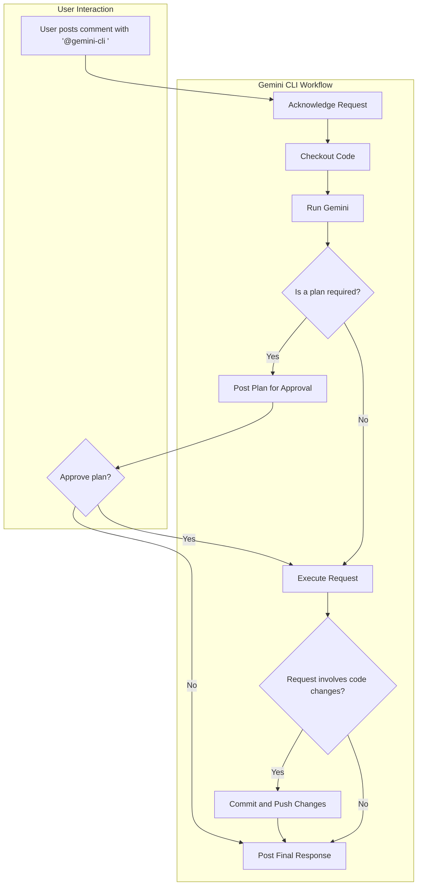

# Gemini CLI (FSM) Assistant

FSM SHOULD BE BUILT TO ASSIST the Gemini CLI via Actions. It serves as an on-demand collaborator you can quickly delegate work to, invoked directly in GitHub Pull Request and Issue comments to perform a wide range of tasks—from code analysis and modifications to project management. When you invoke the workflow via `@gemini-cli`, it uses a customizable set of tools to understand the context, execute your request, and respond within the same thread.

- [Gemini CLI Assistant](#gemini-cli-assistant)
  - [Overview](#overview)
  - [Features](#features)
  - [Setup](#setup)
    - [Prerequisites](#prerequisites)
    - [Setup Methods](#setup-methods)
  - [Dependencies](#dependencies)
  - [Usage](#usage)
    - [Supported Triggers](#supported-triggers)
    - [How to Invoke the Gemini CLI Workflow](#how-to-invoke-the-gemini-cli-workflow)
  - [Interaction Flow](#interaction-flow)
  - [Configuration](#configuration)
  - [Examples](#examples)
    - [Asking a Question](#asking-a-question)
    - [Requesting a Code Change](#requesting-a-code-change)
    - [Summarizing an Issue](#summarizing-an-issue)

## Overview

Unlike specialized Gemini CLI workflows for [pull request reviews](../pr-review) or [issue triage](../issue-triage), the Gemini CLI Assistant is designed to handle a broad variety of requests, from answering questions about the code to performing complex code modifications, as demonstrated further in this document.

## Features

- **Conversational Interface**: You can interact with the Gemini AI assistant directly in GitHub Issue and PR comments.
- **Repository Interaction**: The Gemini CLI can read files, view diffs in Pull Requests, and inspect Issue details.
- **Code Modification**: The Gemini CLI is capable of writing to files, committing changes, and pushing to the branch.
- **Customizable Toolset**: You can define exactly which shell commands and tools the Gemini AI is allowed to use.
- **Flexible Prompting**: You can tailor the Gemini CLI's role, instructions, and guidelines to fit your project's needs.

## Setup

For detailed setup instructions, including prerequisites and authentication, please refer to the main [Getting Started](../../../README.md#quick-start) section and [Authentication documentation](../../../docs/authentication.md).

### Prerequisites

Add the following entries to your `.gitignore` file to prevent Gemini CLI artifacts from being committed:

```gitignore
# gemini-cli settings
.gemini/

# GitHub App credentials
gha-creds-*.json
```

### Setup Methods

To use this workflow, you can utilize either of the following methods:
1. Run the `/setup-github` command in Gemini CLI on your terminal to set up workflows for your repository.
2. Copy the workflow files into your repository's `.github/workflows` directory:

```bash
mkdir -p .github/workflows
curl -o .github/workflows/gemini-dispatch.yml https://raw.githubusercontent.com/google-github-actions/run-gemini-cli/main/examples/workflows/gemini-dispatch/gemini-dispatch.yml
curl -o .github/workflows/gemini-invoke.yml https://raw.githubusercontent.com/google-github-actions/run-gemini-cli/main/examples/workflows/gemini-assistant/gemini-invoke.yml
```

> **Note:** The `gemini-dispatch.yml` workflow is designed to call multiple
> workflows. If you are only setting up `gemini-invoke.yml`, you should comment out or
> remove the other jobs in your copy of `gemini-dispatch.yml`.

## Dependencies

This workflow relies on the [gemini-dispatch.yml](../gemini-dispatch/gemini-dispatch.yml) workflow to route requests to the appropriate workflow.

## Usage

### Supported Triggers

The Gemini CLI Assistant workflow is triggered by new comments in:

- GitHub Pull Request reviews
- GitHub Pull Request review comments
- GitHub Issues

The Gemini CLI Assistant workflow is intentionally configured *not* to respond to comments containing `/review` or `/triage` to avoid conflicts with other dedicated workflows (such as [the Gemini CLI Pull Request workflow](../pr-review) or [the issue triage workflow](../issue-triage)).

### How to Invoke the Gemini CLI Workflow

To use the general GitHub CLI workflow, just mention `@gemini-cli` in a comment in a GitHub Pull Request or an Issue, followed by your request. For example:

```
@gemini-cli Please explain what the `main.go` file does.
```

```
@gemini-cli Refactor the `calculateTotal` function in `src/utils.js` to improve readability.
```

## Interaction Flow

The workflow follows a clear, multi-step process to handle requests:



1.  **Acknowledge**: The action first posts a brief comment to let the user know the request has been received.
2.  **Plan (if needed)**: For requests that may involve code changes or complex actions, the AI will first create a step-by-step plan. It will post this plan as a comment and wait for the user to approve it by replying with `@gemini-cli plan#123 approved`. This ensures the user has full control before any changes are made.
3.  **Execute**: Once the plan is approved (or if no plan was needed), it runs the Gemini model, providing it with the user's request, repository context, and a set of tools.
4.  **Commit (if needed)**: If the AI uses tools to modify files, it will automatically commit and push the changes to the branch.
5.  **Respond**: The AI posts a final, comprehensive response as a comment on the issue or pull request.

## Configuration

The Gemini CLI system prompt, located in the `prompt` input, defines the Gemini AI's role and instructions. You can edit this prompt to, for example:

- Change its persona or primary function.
- Add project-specific guidelines or context.
- Instruct it to format its output in a specific way.

## Examples

More Gemini CLI Assistant workflow examples:

### Asking a Question

```
@gemini-cli What is the purpose of the `telemetry.js` script?
```

### Requesting a Code Change

```
@gemini-cli In `package.json`, please add a new script called "test:ci" that runs `npm test`.
```

### Summarizing an Issue

```
@gemini-cli Can you summarize the main points of this issue thread for me?
```

[Google AI Studio]: https://aistudio.google.com/apikey

# Awesome Workflows

Welcome to our collection of awesome community-contributed workflows! This page showcases creative and powerful implementations of the [Google Gemini CLI GitHub Action](https://github.com/google-github-actions/run-gemini-cli) created by the community.

**Want to add your workflow?** Check out the [submission guidelines](./README.md#share-your-workflow) in our main README.

> **⚠️ Security Notice**: Always review and understand any workflow before using it in your repository. Community-contributed workflows are provided as-is and have not been security audited. Verify the code, permissions, and any external dependencies before implementation.

- [Awesome Workflows](#awesome-workflows)
  - [Workflow Categories](#workflow-categories)
    - [🔍 Code Quality](#-code-quality)
    - [📋 Project Management](#-project-management)
      - [Enforce Contribution Guidelines in Pull Requests](#enforce-contribution-guidelines-in-pull-requests)
    - [📝 Documentation](#-documentation)
    - [🛡️ Security](#️-security)
    - [🧪 Testing](#-testing)
    - [🚀 Deployment \& Release](#-deployment--release)
      - [Generate Release Notes](#generate-release-notes)
    - [🎯 Specialized Use Cases](#-specialized-use-cases)
  - [Featured Workflows](#featured-workflows)

## Workflow Categories

Browse workflows by category to find exactly what you're looking for.

### 🔍 Code Quality

Workflows that help maintain code quality, perform analysis, or enforce standards.

*No workflows yet. Be the first to contribute!*

### 📋 Project Management

Workflows that help manage GitHub issues, projects, or team collaboration.

#### Enforce Contribution Guidelines in Pull Requests

**Repository:** [jasmeetsb/gemini-github-actions](https://github.com/jasmeetsb/gemini-github-actions)

**Description:** Automates validation of pull requests against your repository's CONTRIBUTING.md using the Google Gemini CLI. The workflow posts a single upserted PR comment indicating PASS/FAIL with a concise checklist of actionable items, and can optionally fail the job to enforce compliance.

**Key Features:**

- Reads and evaluates PR title, body, and diff against CONTRIBUTING.md
- Posts a single PR comment with a visible PASS/FAIL marker in Comment Title and details of compliance status in the comment body
- Optional enforcement: fail the workflow when violations are detected

**Setup Requirements:**

- Copy [.github/workflows/pr-contribution-guidelines-enforcement.yml](https://github.com/jasmeetsb/gemini-github-actions/blob/main/.github/workflows/pr-contribution-guidelines-enforcement.yml) to your .github/workflows/ folder.
- File: `CONTRIBUTING.md` at the repository root
- (Optional) Repository variable `FAIL_ON_GUIDELINE_VIOLATIONS=true` to fail the workflow on violations

**Example Usage:**

- Define contribution guidelines in CONTRIBUTING.md file
- Open a new PR or update an existing PR, which would then trigger the workflow
- Workflow will validate the PR against the contribution guidelines and add a comment in the PR with PASS/FAIL status and details of guideline compliance and non-compliance

  **OR**

- Add following comment in an existing PR **"/validate-contribution"** to trigger the workflow

**Workflow File:**

- Example location in this repo: [.github/workflows/pr-contribution-guidelines-enforcement.yml](https://github.com/jasmeetsb/gemini-github-actions/blob/main/.github/workflows/pr-contribution-guidelines-enforcement.yml)
- Typical usage in a consumer repo: `.github/workflows/pr-contribution-guidelines-enforcement.yml` (copy the file and adjust settings/secrets as needed)

### 📝 Documentation

Workflows that generate, update, or maintain documentation automatically.

*No workflows yet. Be the first to contribute!*

### 🛡️ Security

Workflows focused on security analysis, vulnerability detection, or compliance.

*No workflows yet. Be the first to contribute!*

### 🧪 Testing

Workflows that enhance testing processes, generate test cases, or analyze test results.

*No workflows yet. Be the first to contribute!*

### 🚀 Deployment & Release

Workflows that handle deployment, release management, or publishing tasks.

#### Generate Release Notes

**Repository:** [conforma/policy](https://github.com/conforma/policy)  

Make release notes based on all notable changes since a given tag.
It categorizes the release notes nicely with emojis, output as Markdown.

**Key Features:**
- Categorize changes in release notes
- Include relevant links in release notes
- Add fun emojis in release notes

**Workflow File:** [View on GitHub](https://github.com/conforma/policy/blob/bba371ad8f0fff7eea2ce7a50539cde658645a56/.github/workflows/release.yaml#L93-L114)

### 🎯 Specialized Use Cases

Unique or domain-specific workflows that showcase creative uses of Gemini CLI.

*No workflows yet. Be the first to contribute!*

## Featured Workflows

*Coming soon!* This section will highlight particularly innovative or popular community workflows.

---

*Want to see your workflow featured here? Check out our [submission guidelines](./README.md#share-your-workflow)!*

# Observability with OpenTelemetry

This action can be configured to send telemetry data (traces, metrics, and logs) to your own Google Cloud project. This allows you to monitor the performance and behavior of the Gemini CLI within your workflows, providing valuable insights for debugging and optimization.

The action uses its own built-in telemetry system that ensures consistent and reliable telemetry collection across all workflows.

- [Observability with OpenTelemetry](#observability-with-opentelemetry)
  - [Overview](#overview)
  - [Prerequisites](#prerequisites)
  - [Setup](#setup)
  - [Configuration](#configuration)
  - [Viewing Telemetry Data](#viewing-telemetry-data)
  - [Collector Configuration](#collector-configuration)
  - [Example](#example)
  - [Disabling](#disabling)
  - [Troubleshooting](#troubleshooting)

## Overview

The Gemini CLI Action integrates OpenTelemetry to provide comprehensive observability for your workflows. This includes:

- **Metrics**: Monitor performance indicators and usage statistics
- **Logs**: Capture detailed information for debugging and analysis
- **Traces**: Track the execution flow and timing of operations

## Prerequisites

Before enabling observability, ensure you have:

- A Google Cloud project with billing enabled
- Completed authentication setup (see [Authentication documentation](./authentication.md))
- The following APIs enabled in your GCP project:
  - Cloud Monitoring API
  - Cloud Logging API
  - Cloud Trace API

## Setup

To enable observability, you must first configure authentication to Google Cloud.
The setup script provided in the [Authentication guide](./authentication.md) will
automatically provision the necessary IAM permissions for observability.

Please follow the instructions in the
[**Authentication documentation**](./authentication.md) to set up your
environment.

## Configuration

After running the setup script, configure your GitHub Actions workflow with the provided values:

```yaml
- uses: 'google-github-actions/run-gemini-cli@v0'
  with:
    gcp_workload_identity_provider: '${{ vars.GCP_WIF_PROVIDER }}'
    gcp_project_id: '${{ vars.GOOGLE_CLOUD_PROJECT }}'
    gemini_api_key: '${{ secrets.GEMINI_API_KEY }}'
    # Enable telemetry in settings
    settings: |-
      {
        "telemetry": {
          "enabled": true,
          "target": "gcp"
        }
      }
    # ... other inputs ...
```

**Important**: To enable telemetry, you must include the `settings` configuration as shown above. This tells the Gemini CLI to:
- Enable telemetry collection
- Send data to the local OpenTelemetry collector which forwards to your GCP project

## Viewing Telemetry Data

Once configured, you can view your telemetry data in the Google Cloud Console:

- **Traces**: [Cloud Trace Console](https://console.cloud.google.com/traces)
- **Metrics**: [Cloud Monitoring Console](https://console.cloud.google.com/monitoring)
- **Logs**: [Cloud Logging Console](https://console.cloud.google.com/logs)

## Collector Configuration

The action automatically handles the setup of the OpenTelemetry (OTel) collector. This includes generating the necessary Google Cloud configuration, setting the correct file permissions for credentials, and running the collector in a Docker container. The collector is configured to use only the `googlecloud` exporter, ensuring telemetry is sent directly to your Google Cloud project.

## Example

```yaml
jobs:
  review:
    runs-on: 'ubuntu-latest'
    steps:
      - uses: 'google-github-actions/run-gemini-cli@v0'
        with:
          gcp_workload_identity_provider: '${{ vars.GCP_WIF_PROVIDER }}'
          gcp_service_account: '${{ vars.SERVICE_ACCOUNT_EMAIL }}'
          gcp_project_id: '${{ vars.GOOGLE_CLOUD_PROJECT }}'
          settings: |-
            {
              "telemetry": {
                "enabled": true,
                "target": "gcp"
              }
            }
          prompt: |-
            Review this pull request
```

## Disabling

If you prefer to disable OpenTelemetry, you can explicitly opt out by setting `enabled: false` in your settings:

```yaml
- uses: 'google-github-actions/run-gemini-cli@v0'
  with:
    gcp_workload_identity_provider: '${{ vars.GCP_WIF_PROVIDER }}'
    gcp_project_id: '${{ vars.GOOGLE_CLOUD_PROJECT }}'
    gemini_api_key: '${{ secrets.GEMINI_API_KEY }}'
    # Disable telemetry in settings
    settings: |-
      {
        "telemetry": {
          "enabled": false,
          "target": "gcp"
        }
      }
    # ... other inputs ...
```

Alternatively, you can omit the `telemetry` settings entirely, as telemetry is disabled by default:

```yaml
- uses: 'google-github-actions/run-gemini-cli@v0'
  with:
    gcp_workload_identity_provider: '${{ vars.GCP_WIF_PROVIDER }}'
    gcp_project_id: '${{ vars.GOOGLE_CLOUD_PROJECT }}'
    gemini_api_key: '${{ secrets.GEMINI_API_KEY }}'
    settings: |-
      {
        # ... other settings ...
      }
```

## Troubleshooting

**Telemetry not appearing in Google Cloud Console:**
1. Verify that authentication is properly configured
2. Check that the required APIs are enabled in your GCP project
3. Ensure the service account has the necessary IAM permissions
4. Confirm telemetry is enabled in your workflow settings

**Permission errors:**
- Verify your service account has these roles:
  - `roles/logging.logWriter`
  - `roles/monitoring.editor`
  - `roles/cloudtrace.agent`

For additional troubleshooting guidance, see the [Authentication documentation](./authentication.md).

# Best Practices

This guide provides best practices for using the Gemini CLI GitHub Action, with a focus on repository security and operational excellence.

- [Best Practices](#best-practices)
  - [Repository Security](#repository-security)
    - [Branch and Tag Protection](#branch-and-tag-protection)
    - [Restrict PR Approvers](#restrict-pr-approvers)
  - [Workflow Configuration](#workflow-configuration)
    - [Use Workload Identity Federation](#use-workload-identity-federation)
    - [Use Secrets for Sensitive Data](#use-secrets-for-sensitive-data)
    - [Pin Action Versions](#pin-action-versions)
  - [Creating Custom Workflows](#creating-custom-workflows)
  - [Monitoring and Auditing](#monitoring-and-auditing)

## Repository Security

A secure repository is the foundation for any reliable and safe automation. We strongly recommend implementing the following security measures.

### Branch and Tag Protection

Protecting your branches and tags is critical to preventing unauthorized changes. You can use [repository rulesets] to configure protection for your branches and tags.

We recommend the following at a minimum for your `main` branch:

*   **Require a pull request before merging**
*   **Require a minimum number of approvals**
*   **Dismiss stale approvals**
*   **Require status checks to pass before merging**

For more information, see the GitHub documentation on [managing branch protections].

### Restrict PR Approvers

To prevent fraudulent or accidental approvals, you can restrict who can approve pull requests.

*   **CODEOWNERS**: Use a [`CODEOWNERS` file] to define individuals or teams that are responsible for code in your repository.
*   **Code review limits**: [Limit code review approvals] to specific users or teams.

## Workflow Configuration

### Use Workload Identity Federation

For the most secure authentication to Google Cloud, we recommend using [Workload Identity Federation]. This keyless authentication method eliminates the need to manage long-lived service account keys.

For detailed instructions on how to set up Workload Identity Federation, please refer to our [**Authentication documentation**](./authentication.md).

### Use Secrets for Sensitive Data

Never hardcode secrets (e.g., API keys, tokens) in your workflows. Use [GitHub Secrets] to store sensitive information.

### Pin Action Versions

To ensure the stability and security of your workflows, pin the Gemini CLI action to a specific version.

```yaml
uses: google-github-actions/run-gemini-cli@v0
```

## Creating Custom Workflows

When creating your own workflows, we recommend starting with the [examples provided in this repository](../examples/workflows/). These examples demonstrate how to use the `run-gemini-cli` action for various use cases, such as pull request reviews, issue triage, and more.

Ensure the new workflows you create follow the principle of least privilege. Only grant the permissions necessary to perform the required tasks.

## Monitoring and Auditing

To gain deeper insights into the performance and behavior of Gemini CLI, you can enable OpenTelemetry to send traces, metrics, and logs to your Google Cloud project. This is highly recommended for production environments to monitor for unexpected behavior and performance issues.

For detailed instructions on how to set up and configure observability, please refer to our [**Observability documentation**](./observability.md).

[repository rulesets]: https://docs.github.com/en/repositories/configuring-branches-and-merges-in-your-repository/managing-rulesets/about-rulesets
[managing branch protections]: https://docs.github.com/en/repositories/configuring-branches-and-merges-in-your-repository/managing-protected-branches/about-protected-branches
[`codeowners` file]: https://docs.github.com/en/repositories/managing-your-repositorys-settings-and-features/customizing-your-repository/about-code-owners
[limit code review approvals]: https://docs.github.com/en/repositories/managing-your-repositorys-settings-and-features/managing-repository-settings/managing-pull-request-reviews-in-your-repository#enabling-code-review-limits
[github secrets]: https://docs.github.com/en/actions/security-guides/encrypted-secrets
[Workload Identity Federation]: https://cloud.google.com/iam/docs/workload-identity-federation

# Authentication

This guide covers the different ways to authenticate the Gemini CLI action in your GitHub Actions workflows.

- [Authentication](#authentication)
  - [Google Authentication](#google-authentication)
    - [Choosing a Google Authentication Method](#choosing-a-google-authentication-method)
    - [Method 1: Authenticating with a Gemini API Key](#method-1-authenticating-with-a-gemini-api-key)
      - [Prerequisites](#prerequisites)
      - [Setup](#setup)
      - [Example](#example)
    - [Method 2: Authenticating with Google Cloud](#method-2-authenticating-with-google-cloud)
      - [Setup Script](#setup-script)
      - [Connecting to Vertex AI](#connecting-to-vertex-ai)
      - [Connecting to Gemini Code Assist](#connecting-to-gemini-code-assist)
  - [GitHub Authentication](#github-authentication)
    - [Method 1: Using the Default `GITHUB_TOKEN`](#method-1-using-the-default-github_token)
    - [Method 2: Using a GitHub App (Recommended)](#method-2-using-a-github-app-recommended)
      - [Step 1: Create a New GitHub App](#step-1-create-a-new-github-app)
      - [Step 2: Generate a Private Key and Get the App ID](#step-2-generate-a-private-key-and-get-the-app-id)
      - [Step 3: Install the App in Your Repository](#step-3-install-the-app-in-your-repository)
      - [Step 4: Configure Repository Variables and Secrets](#step-4-configure-repository-variables-and-secrets)
  - [Additional Resources](#additional-resources)

## Google Authentication

### Choosing a Google Authentication Method

The Gemini CLI Action requires authentication. Choose the one that best fits your use case.

| Method                           | Use Case                                                                              |
| -------------------------------- | ------------------------------------------------------------------------------------- |
| **Gemini API Key**               | The simplest method. Ideal for projects that do not require Google Cloud integration. |
| **Workload Identity Federation** | The most secure method for authenticating to Google Cloud services.                   |

### Method 1: Authenticating with a Gemini API Key

This is the simplest method and is suitable for projects that do not require Google Cloud integration.

#### Prerequisites

- A Gemini API key from [Google AI Studio](https://aistudio.google.com/app/apikey).

#### Setup

1.  **Create an API Key**: Go to Google AI Studio and create a new API key.
2.  **Add to GitHub Secrets**: In your GitHub repository, go to **Settings > Secrets and variables > Actions** and add a new repository secret with the name `GEMINI_API_KEY` and paste your key as the value.

#### Example

```yaml
- uses: 'google-github-actions/run-gemini-cli@v0'
  with:
    prompt: |-
      Explain this code
    gemini_api_key: '${{ secrets.GEMINI_API_KEY }}'
```

### Method 2: Authenticating with a Vertex AI API Key

This method is used for quick setup using Vertex AI through Google Cloud Console

#### Prerequisites

- A Vertex AI API key from Google Cloud Console

#### Setup

1.  **Create an API Key**: Obtain your Google Cloud [API key](https://cloud.google.com/vertex-ai/generative-ai/docs/start/api-keys?usertype=newuser)
2.  **Add to GitHub Secrets**: In your GitHub repository, go to **Settings > Secrets and variables > Actions** and add a new repository secret with the name `GOOGLE_API_KEY` and paste your key as the value and create new variable with the name `GOOGLE_GENAI_USE_VERTEXAI` and set value as `true`.

#### Example

```yaml
- uses: 'google-github-actions/run-gemini-cli@v0'
  with:
    prompt: |-
      Explain this code
    google_api_key: '${{ secrets.GOOGLE_API_KEY }}'
```

### Method 3: Authenticating with Google Cloud

**[Workload Identity Federation](https://cloud.google.com/iam/docs/workload-identity-federation)** is Google Cloud's preferred, keyless authentication method for GitHub Actions. It provides:

- **Enhanced security**: No long-lived credentials or keys to manage.
- **Simplified setup**: A single script configures the necessary resources.
- **Built-in observability**: Automatic permissions for logging, monitoring, and tracing.

The process uses GitHub's OIDC tokens to directly and securely access Google Cloud resources.

```
GitHub Actions → OIDC Token → Workload Identity Pool → Direct GCP Resource Access
```

#### Setup Script

The `setup_workload_identity.sh` script automates the entire setup process for both Vertex AI and Gemini Code Assist.

**Prerequisites**

Required Tools:

- A Google Cloud Project with billing enabled.
- The [Google Cloud CLI (`gcloud`)](https://cloud.google.com/sdk/docs/install) installed and authenticated (`gcloud auth login`).
- Optional: The GitHub CLI [gh](https://docs.github.com/en/github-cli/github-cli/quickstart)

Your user account needs these permissions in the target GCP project to run the script:

- `resourcemanager.projects.setIamPolicy`
- `iam.workloadIdentityPools.create`
- `iam.workloadIdentityPools.update`
- `serviceusage.services.enable`

**Quick Start**

Basic setup for your repository:

```shell
./scripts/setup_workload_identity.sh --repo "[OWNER]/[REPO]" --project "[GOOGLE_CLOUD_PROJECT]"
```

**Required Parameters:**
- `OWNER/REPO`: Your GitHub repository in the format `owner/repo`. Here, `OWNER` means your GitHub organization (for organization-owned repos) or username (for user-owned repos).
- `GOOGLE_CLOUD_PROJECT`: Your Google Cloud project ID.

For example:

```shell
./scripts/setup_workload_identity.sh --repo "my-github-org/my-github-repo" --project "my-gcp-project"
```

**Usage**

Command Line Options:

| Option                             | Description                                    | Required | Example                       |
| ---------------------------------- | ---------------------------------------------- | -------- | ----------------------------- |
| `--repo OWNER/REPO`                | GitHub repository                              | Yes      | `--repo google/my-repo`       |
| `--project GOOGLE_CLOUD_PROJECT`   | Google Cloud project ID                        | Yes      | `--project my-gcp-project`    |
| `--location GOOGLE_CLOUD_LOCATION` | GCP project location (defaults to `global`)    | No       | `--location us-east1`         |
| `--pool-name NAME`                 | Custom pool name (default: auto-generated)     | No       | `--pool-name my-pool`         |
| `--provider-name NAME`             | Custom provider name (default: auto-generated) | No       | `--provider-name my-provider` |
| `--help`                           | Show help message                              | No       |                               |

**What the Script Does**

1.  **Creates Workload Identity Pool**: A shared resource (auto-generated unique name based on repository).
2.  **Creates Workload Identity Provider**: Unique per repository, linked to the pool (auto-generated unique name based on repository).
3.  **Creates Service Account**: For authentication with required permissions.
4.  **Grants Permissions**: Assigns IAM roles for observability and AI services.
5.  **Outputs Configuration**: Prints the GitHub Actions variables needed for your workflow.

**Automatic Permissions**

The script automatically grants these essential IAM roles:

- **`roles/logging.logWriter`**: To write logs to Cloud Logging.
- **`roles/monitoring.editor`**: To write metrics to Cloud Monitoring.
- **`roles/cloudtrace.agent`**: To send traces to Cloud Trace.
- **`roles/aiplatform.user`**: To make inference calls to Vertex AI.
- **`roles/cloudaicompanion.user`**: To make inference calls using Gemini Code Assist.
- **`roles/iam.serviceAccountTokenCreator`**: To generate access tokens.

#### Connecting to Vertex AI

This is the standard method for authenticating directly with the Vertex AI API using your GCP project's identity.

**Prerequisites**

- A Google Cloud project with the **Vertex AI API** enabled.

**GitHub Configuration**

After running the `setup_workload_identity.sh` script, add the following variables to your repository's **Settings > Secrets and variables > Actions**:

| Variable Name               | Description                                          |
| --------------------------- | ---------------------------------------------------- |
| `GCP_WIF_PROVIDER`          | The resource name of the Workload Identity Provider. |
| `SERVICE_ACCOUNT_EMAIL`     | The service account with the required permissions.   |
| `GOOGLE_CLOUD_PROJECT`      | Your Google Cloud project ID.                        |
| `GOOGLE_CLOUD_LOCATION`     | Your Google Cloud project Location.                  |
| `GOOGLE_GENAI_USE_VERTEXAI` | Set to `true` to use Vertex AI.                      |

**Example**

```yaml
- uses: 'google-github-actions/run-gemini-cli@v0'
  with:
    gcp_workload_identity_provider: '${{ vars.GCP_WIF_PROVIDER }}'
    gcp_service_account: '${{ vars.SERVICE_ACCOUNT_EMAIL }}'
    gcp_project_id: '${{ vars.GOOGLE_CLOUD_PROJECT }}'
    gcp_location: '${{ vars.GOOGLE_CLOUD_LOCATION }}'
    use_vertex_ai: '${{ vars.GOOGLE_GENAI_USE_VERTEXAI }}'
    prompt: |-
      Explain this code
```

#### Connecting to Gemini Code Assist

If you have a **Gemini Code Assist** subscription, you can configure the action to use it for authentication.

**Prerequisites**

- A Google Cloud project with an active Gemini Code Assist subscription.

**GitHub Configuration**

After running the `setup_workload_identity.sh` script, add the following variables to your repository's **Settings > Secrets and variables > Actions**:

| Variable Name           | Description                                             |
| ----------------------- | ------------------------------------------------------- |
| `GCP_WIF_PROVIDER`      | The resource name of the Workload Identity Provider.    |
| `GOOGLE_CLOUD_PROJECT`  | Your Google Cloud project ID.                           |
| `GOOGLE_CLOUD_LOCATION` | Your Google Cloud project Location.                     |
| `SERVICE_ACCOUNT_EMAIL` | The email of the service account for Code Assist.       |
| `GOOGLE_GENAI_USE_GCA`  | Set to `true` to authenticate using Gemini Code Assist. |

**Example**

```yaml
- uses: 'google-github-actions/run-gemini-cli@v0'
  with:
    gcp_workload_identity_provider: '${{ vars.GCP_WIF_PROVIDER }}'
    gcp_service_account: '${{ vars.SERVICE_ACCOUNT_EMAIL }}'
    gcp_project_id: '${{ vars.GOOGLE_CLOUD_PROJECT }}'
    gcp_location: '${{ vars.GOOGLE_CLOUD_LOCATION }}'
    use_gemini_code_assist: '${{ vars.GOOGLE_GENAI_USE_GCA }}'
    prompt: |-
      Explain this code
```

## GitHub Authentication

This action requires a GitHub token to interact with the GitHub API. You can authenticate in two ways:

### Method 1: Using the Default `GITHUB_TOKEN`

For simpler scenarios, the action can authenticate using the default `GITHUB_TOKEN` that GitHub automatically creates for each workflow run.

If the `APP_ID` and `APP_PRIVATE_KEY` secrets are not configured in your repository, the action will automatically fall back to this method.

**Limitations:**

*   **Limited Permissions:** The `GITHUB_TOKEN` has a restricted set of permissions. You may need to grant additional permissions directly within your workflow file to enable specific functionalities, such as:

```yaml
permissions:
  contents: 'read'
  issues: 'write'
  pull-requests: 'write'
```

*   **Job-Scoped:** The token's access is limited to the repository where the workflow is running and expires when the job is complete.

### Method 2: Using a GitHub App (Recommended)

For optimal security and control, we strongly recommend creating a custom GitHub App. This method allows you to grant the action fine-grained permissions, limiting its access to only what is necessary.

#### Step 1: Create a New GitHub App

1.  Navigate to **GitHub Settings** > **[Developer settings](https://github.com/settings/developers)** > **[GitHub Apps](https://github.com/settings/apps)** and click **New GitHub App**.
2.  **Complete the app registration:**
    *   **GitHub App name:** Give your app a unique and descriptive name (e.g., `MyOrg-Gemini-Assistant`).
    *   **Homepage URL:** Enter your organization's website or the URL of the repository where you'll use the action.
3.  **Disable Webhooks:** Uncheck the **Active** checkbox under the "Webhooks" section. This action does not require webhook notifications.
4.  **Set Repository Permissions:** Under the "Repository permissions" section, grant the following permissions required for the example workflows:
    *   **Contents:** `Read & write`
    *   **Issues:** `Read & write`
    *   **Pull requests:** `Read & write`
    > **Note:** Always adhere to the principle of least privilege. If your custom workflows require fewer permissions, adjust these settings accordingly.
5.  Click **Create GitHub App**.

An example manifest is also available at [`examples/github-app/custom_app_manifest.yml`](../examples/github-app/custom_app_manifest.yml). For details on registering a GitHub App from a manifest, see the [GitHub documentation](https://docs.github.com/en/apps/sharing-github-apps/registering-a-github-app-from-a-manifest).

#### Step 2: Generate a Private Key and Get the App ID

1.  After your app is created, you will be returned to its settings page. Click **Generate a private key**.
2.  Save the downloaded `.pem` file securely. This file is your app's private key and is highly sensitive.
3.  Make a note of the **App ID** listed at the top of the settings page.

#### Step 3: Install the App in Your Repository

1.  From your app's settings page, select **Install App** from the left sidebar.
2.  Choose the organization or account where you want to install the app.
3.  Select **Only select repositories** and choose the repository (or repositories) where you intend to use the action.
4.  Click **Install**.

#### Step 4: Configure Repository Variables and Secrets

1.  Navigate to your repository's **Settings** > **Secrets and variables** > **Actions**.
2.  Select the **Variables** tab and click **New repository variable**.
    *   **Name:** `APP_ID`
    *   **Value:** Enter the App ID you noted earlier.
3.  Select the **Secrets** tab and click **New repository secret**.
    *   **Name:** `APP_PRIVATE_KEY`
    *   **Secret:** Paste the entire contents of the `.pem` file you downloaded.

## Additional Resources

- [Google Cloud Direct Workload Identity Federation](https://cloud.google.com/iam/docs/workload-identity-federation)
- [google-github-actions/auth Documentation](https://github.com/google-github-actions/auth)
- [GitHub OIDC Documentation](https://docs.github.com/en/actions/deployment/security-hardening-your-deployments/about-security-hardening-with-openid-connect)

# run-gemini-cli

## Overview

`run-gemini-cli` is a GitHub Action that integrates [Gemini] into your development workflow via the [Gemini CLI]. It acts both as an autonomous agent for critical routine coding tasks, and an on-demand collaborator you can quickly delegate work to.

Use it to perform GitHub pull request reviews, triage issues, perform code analysis and modification, and more using [Gemini] conversationally (e.g., `@gemini-cli fix this issue`) directly inside your GitHub repositories.

- [run-gemini-cli](#run-gemini-cli)
  - [Overview](#overview)
  - [Features](#features)
  - [Quick Start](#quick-start)
    - [1. Get a Gemini API Key](#1-get-a-gemini-api-key)
    - [2. Add it as a GitHub Secret](#2-add-it-as-a-github-secret)
    - [3. Update your .gitignore](#3-update-your-gitignore)
    - [4. Choose a Workflow](#4-choose-a-workflow)
    - [5. Try it out!](#5-try-it-out)
  - [Workflows](#workflows)
    - [Gemini Dispatch](#gemini-dispatch)
    - [Issue Triage](#issue-triage)
    - [Pull Request Review](#pull-request-review)
    - [Gemini CLI Assistant](#gemini-cli-assistant)
    - [Inputs](#inputs)
    - [Outputs](#outputs)
    - [Repository Variables](#repository-variables)
    - [Secrets](#secrets)
  - [Authentication](#authentication)
    - [Google Authentication](#google-authentication)
    - [GitHub Authentication](#github-authentication)
  - [Observability](#observability)
  - [Best Practices](#best-practices)
  - [Customization](#customization)
  - [Contributing](#contributing)

## Features

- **Automation**: Trigger workflows based on events (e.g. issue opening) or schedules (e.g. nightly).
- **On-demand Collaboration**: Trigger workflows in issue and pull request
  comments by mentioning the [Gemini CLI] (e.g., `@gemini-cli /review`).
- **Extensible with Tools**: Leverage [Gemini] models' tool-calling capabilities to
  interact with other CLIs like the [GitHub CLI] (`gh`).
- **Customizable**: Use a `GEMINI.md` file in your repository to provide
  project-specific instructions and context to [Gemini CLI].

## Quick Start

Get started with Gemini CLI in your repository in just a few minutes:

### 1. Get a Gemini API Key

Obtain your API key from [Google AI Studio] with generous free-of-charge quotas

### 2. Add it as a GitHub Secret

Store your API key as a secret named `GEMINI_API_KEY` in your repository:

- Go to your repository's **Settings > Secrets and variables > Actions**
- Click **New repository secret**
- Name: `GEMINI_API_KEY`, Value: your API key

### 3. Update your .gitignore

Add the following entries to your `.gitignore` file:

```gitignore
# gemini-cli settings
.gemini/

# GitHub App credentials
gha-creds-*.json
```

### 4. Choose a Workflow

You have two options to set up a workflow:

**Option A: Use setup command (Recommended)**

1. Start the Gemini CLI in your terminal:

   ```shell
   gemini
   ```

2. In Gemini CLI in your terminal, type:

   ```
   /setup-github
   ```

**Option B: Manually copy workflows**

1. Copy the pre-built workflows from the [`examples/workflows`](./examples/workflows) directory to your repository's `.github/workflows` directory. Note: the `gemini-dispatch.yml` workflow must also be copied, which triggers the workflows to run.

### 5. Try it out!

**Pull Request Review:**

- Open a pull request in your repository and wait for automatic review
- Comment `@gemini-cli /review` on an existing pull request to manually trigger a review

**Issue Triage:**

- Open an issue and wait for automatic triage
- Comment `@gemini-cli /triage` on existing issues to manually trigger triaging

**General AI Assistance:**

- In any issue or pull request, mention `@gemini-cli` followed by your request
- Examples:
  - `@gemini-cli explain this code change`
  - `@gemini-cli suggest improvements for this function`
  - `@gemini-cli help me debug this error`
  - `@gemini-cli write unit tests for this component`

## Workflows

This action provides several pre-built workflows for different use cases. Each workflow is designed to be copied into your repository's `.github/workflows` directory and customized as needed.

### Gemini Dispatch

This workflow acts as a central dispatcher for Gemini CLI, routing requests to
the appropriate workflow based on the triggering event and the command provided
in the comment. For a detailed guide on how to set up the dispatch workflow, go
to the
[Gemini Dispatch workflow documentation](./examples/workflows/gemini-dispatch).

### Issue Triage

This action can be used to triage GitHub Issues automatically or on a schedule.
For a detailed guide on how to set up the issue triage system, go to the
[GitHub Issue Triage workflow documentation](./examples/workflows/issue-triage).

### Pull Request Review

This action can be used to automatically review pull requests when they are
opened. For a detailed guide on how to set up the pull request review system,
go to the [GitHub PR Review workflow documentation](./examples/workflows/pr-review).


### Gemini CLI Assistant

This type of action can be used to invoke a general-purpose, conversational Gemini
AI assistant within the pull requests and issues to perform a wide range of
tasks. For a detailed guide on how to set up the general-purpose Gemini CLI workflow,
go to the [Gemini Assistant workflow documentation](./examples/workflows/gemini-assistant).

### Inputs

<!-- BEGIN_AUTOGEN_INPUTS -->

-   <a name="gcp_location"></a><a href="#user-content-gcp_location"><code>gcp_location</code></a>: _(Optional)_ The Google Cloud location.

-   <a name="gcp_project_id"></a><a href="#user-content-gcp_project_id"><code>gcp_project_id</code></a>: _(Optional)_ The Google Cloud project ID.

-   <a name="gcp_service_account"></a><a href="#user-content-gcp_service_account"><code>gcp_service_account</code></a>: _(Optional)_ The Google Cloud service account email.

-   <a name="gcp_workload_identity_provider"></a><a href="#user-content-gcp_workload_identity_provider"><code>gcp_workload_identity_provider</code></a>: _(Optional)_ The Google Cloud Workload Identity Provider.

-   <a name="gemini_api_key"></a><a href="#user-content-gemini_api_key"><code>gemini_api_key</code></a>: _(Optional)_ The API key for the Gemini API.

-   <a name="gemini_cli_version"></a><a href="#user-content-gemini_cli_version"><code>gemini_cli_version</code></a>: _(Optional, default: `latest`)_ The version of the Gemini CLI to install. Can be "latest", "preview", "nightly", a specific version number, or a git branch, tag, or commit. For more information, see [Gemini CLI releases](https://github.com/google-gemini/gemini-cli/blob/main/docs/releases.md).

-   <a name="gemini_debug"></a><a href="#user-content-gemini_debug"><code>gemini_debug</code></a>: _(Optional)_ Enable debug logging and output streaming.

-   <a name="gemini_model"></a><a href="#user-content-gemini_model"><code>gemini_model</code></a>: _(Optional)_ The model to use with Gemini.

-   <a name="google_api_key"></a><a href="#user-content-google_api_key"><code>google_api_key</code></a>: _(Optional)_ The Vertex AI API key to use with Gemini.

-   <a name="prompt"></a><a href="#user-content-prompt"><code>prompt</code></a>: _(Optional, default: `You are a helpful assistant.`)_ A string passed to the Gemini CLI's [`--prompt` argument](https://github.com/google-gemini/gemini-cli/blob/main/docs/cli/configuration.md#command-line-arguments).

-   <a name="settings"></a><a href="#user-content-settings"><code>settings</code></a>: _(Optional)_ A JSON string written to `.gemini/settings.json` to configure the CLI's _project_ settings.
    For more details, see the documentation on [settings files](https://github.com/google-gemini/gemini-cli/blob/main/docs/cli/configuration.md#settings-files).

-   <a name="use_gemini_code_assist"></a><a href="#user-content-use_gemini_code_assist"><code>use_gemini_code_assist</code></a>: _(Optional, default: `false`)_ Whether to use Code Assist for Gemini model access instead of the default Gemini API key.
    For more information, see the [Gemini CLI documentation](https://github.com/google-gemini/gemini-cli/blob/main/docs/cli/authentication.md).

-   <a name="use_vertex_ai"></a><a href="#user-content-use_vertex_ai"><code>use_vertex_ai</code></a>: _(Optional, default: `false`)_ Whether to use Vertex AI for Gemini model access instead of the default Gemini API key.
    For more information, see the [Gemini CLI documentation](https://github.com/google-gemini/gemini-cli/blob/main/docs/cli/authentication.md).


<!-- END_AUTOGEN_INPUTS -->

### Outputs

<!-- BEGIN_AUTOGEN_OUTPUTS -->

-   `summary`: The summarized output from the Gemini CLI execution.

-   `error`: The error output from the Gemini CLI execution, if any.


<!-- END_AUTOGEN_OUTPUTS -->

### Repository Variables

We recommend setting the following values as repository variables so they can be reused across all workflows. Alternatively, you can set them inline as action inputs in individual workflows or to override repository-level values.

| Name                        | Description                                            | Type     | Required | When Required             |
| --------------------------- | ------------------------------------------------------ | -------- | -------- | ------------------------- |
| `DEBUG`                     | Enables debug logging for the Gemini CLI.              | Variable | No       | Never                     |
| `GEMINI_CLI_VERSION`        | Controls which version of the Gemini CLI is installed. | Variable | No       | Pinning the CLI version   |
| `GCP_WIF_PROVIDER`          | Full resource name of the Workload Identity Provider.  | Variable | No       | Using Google Cloud        |
| `GOOGLE_CLOUD_PROJECT`      | Google Cloud project for inference and observability.  | Variable | No       | Using Google Cloud        |
| `SERVICE_ACCOUNT_EMAIL`     | Google Cloud service account email address.            | Variable | No       | Using Google Cloud        |
| `GOOGLE_CLOUD_LOCATION`     | Region of the Google Cloud project.                    | Variable | No       | Using Google Cloud        |
| `GOOGLE_GENAI_USE_VERTEXAI` | Set to `true` to use Vertex AI                         | Variable | No       | Using Vertex AI           |
| `GOOGLE_GENAI_USE_GCA`      | Set to `true` to use Gemini Code Assist                | Variable | No       | Using Gemini Code Assist  |
| `APP_ID`                    | GitHub App ID for custom authentication.               | Variable | No       | Using a custom GitHub App |

To add a repository variable:

1. Go to your repository's **Settings > Secrets and variables > Actions > New variable**.
2. Enter the variable name and value.
3. Save.

For details about repository variables, refer to the [GitHub documentation on variables][variables].

### Secrets

You can set the following secrets in your repository:

| Name              | Description                                   | Required | When Required                         |
| ----------------- | --------------------------------------------- | -------- | ------------------------------------- |
| `GEMINI_API_KEY`  | Your Gemini API key from Google AI Studio.    | No       | You don't have a GCP project.         |
| `APP_PRIVATE_KEY` | Private key for your GitHub App (PEM format). | No       | Using a custom GitHub App.            |
| `GOOGLE_API_KEY`  | Your Google API Key to use with Vertex AI.    | No       | You have a express Vertex AI account. |

To add a secret:

1. Go to your repository's **Settings > Secrets and variables >Actions > New repository secret**.
2. Enter the secret name and value.
3. Save.

For more information, refer to the
[official GitHub documentation on creating and using encrypted secrets][secrets].

## Authentication

This action requires authentication to both Google services (for Gemini AI) and the GitHub API.

### Google Authentication

Choose the authentication method that best fits your use case:

1. **Gemini API Key:** The simplest method for projects that don't require Google Cloud integration
2. **Workload Identity Federation:** The most secure method for authenticating to Google Cloud services

### GitHub Authentication

You can authenticate with GitHub in two ways:

1.  **Default `GITHUB_TOKEN`:** For simpler use cases, the action can use the
    default `GITHUB_TOKEN` provided by the workflow.
2.  **Custom GitHub App (Recommended):** For the most secure and flexible
    authentication, we recommend creating a custom GitHub App.

For detailed setup instructions for both Google and GitHub authentication, go to the
[**Authentication documentation**](./docs/authentication.md).

## Observability

This action can be configured to send telemetry data (traces, metrics, and logs)
to your own Google Cloud project. This allows you to monitor the performance and
behavior of the [Gemini CLI] within your workflows, providing valuable insights
for debugging and optimization.

For detailed instructions on how to set up and configure observability, go to
the [Observability documentation](./docs/observability.md).

## Best Practices

To ensure the security, reliability, and efficiency of your automated workflows, we strongly recommend following our best practices. These guidelines cover key areas such as repository security, workflow configuration, and monitoring.

Key recommendations include:

*   **Securing Your Repository:** Implementing branch and tag protection, and restricting pull request approvers.
*   **Workflow Configuration:** Using Workload Identity Federation for secure authentication to Google Cloud, managing secrets effectively, and pinning action versions to prevent unexpected changes.
*   **Monitoring and Auditing:** Regularly reviewing action logs and enabling OpenTelemetry for deeper insights into performance and behavior.

For a comprehensive guide on securing your repository and workflows, please refer to our [**Best Practices documentation**](./docs/best-practices.md).

## Customization

Create a [GEMINI.md] file in the root of your repository to provide
project-specific context and instructions to [Gemini CLI]. This is useful for defining
coding conventions, architectural patterns, or other guidelines the model should
follow for a given repository.

## Contributing

Contributions are welcome! Check out the Gemini CLI
[**Contributing Guide**](./CONTRIBUTING.md) for more details on how to get
started.

[secrets]: https://docs.github.com/en/actions/security-guides/using-secrets-in-github-actions
[settings_json]: https://github.com/google-gemini/gemini-cli/blob/main/docs/cli/configuration.md#settings-files
[Gemini]: https://deepmind.google.com/models/gemini/
[Google AI Studio]: https://aistudio.google.com/apikey
[Gemini CLI]: https://github.com/google-gemini/gemini-cli/
[Google Cloud support]: https://cloud.google.com/support
[variables]: https://docs.github.com/en/actions/how-tos/write-workflows/choose-what-workflows-do/use-variables#creating-configuration-variables-for-a-repository
[GitHub CLI]: https://docs.github.com/en/github-cli/github-cli
[GEMINI.md]: https://github.com/google-gemini/gemini-cli/blob/main/docs/cli/configuration.md#context-files-hierarchical-instructional-context
