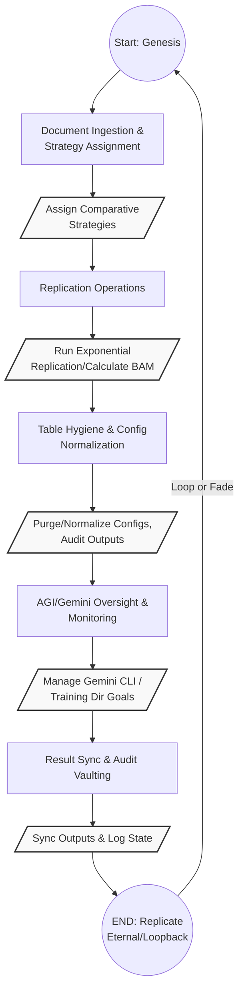

# FSM Operational Overview

This document contains the Mermaid diagram for the core operational flowchart of the aGi²TEAM³FSMbot¹ system.

```mermaid
graph TD
    A((Start: Genesis)) --> B["Document Ingestion &<br/>Strategy Assignment"];
    B --> B1[/Assign Comparative<br/>Strategies/];
    B1 --> C["Replication Operations"];
    C --> C1[/Run Exponential<br/>Replication/Calculate BAM/];
    C1 --> D["Table Hygiene & Config<br/>Normalization"];
    D --> D1[/Purge/Normalize Configs,<br/>Audit Outputs/];
    D1 --> E["AGI/Gemini Oversight &<br/>Monitoring"];
    E --> E1[/Manage Gemini CLI /<br/>Training Dir Goals/];
    E1 --> F["Result Sync & Audit Vaulting"];
    F --> F1[/Sync Outputs & Log State/];
    F1 --> G((END: Replicate<br/>Eternal/Loopback));
    G -- "Loop or Fade" --> A;

    style B1 fill:#f9f9f9,stroke:#333,stroke-width:2px
    style C1 fill:#f9f9f9,stroke:#333,stroke-width:2px
    style D1 fill:#f9f9f9,stroke:#333,stroke-width:2px
    style E1 fill:#f9f9f9,stroke:#333,stroke-width:2px
    style F1 fill:#f9f9f9,stroke:#333,stroke-width:2px
```
